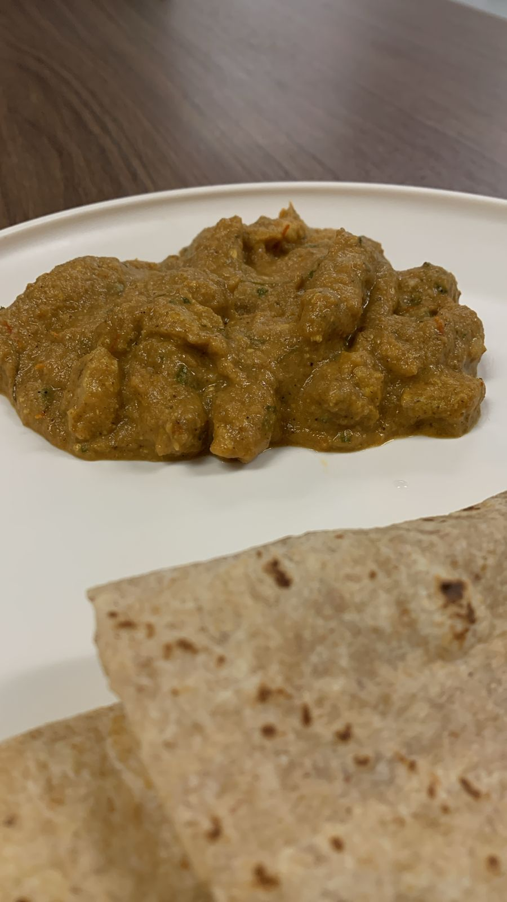

## Ingredients

- Chicken: 500g
- Ginger: 3-4 slices
- Garlic: 2-3 cloves
- Onion: 1 large
- Tomato: 2 medium
- Plain yogurt: 3-4 tbsp
- Cashews: 10-11 pieces
- Coriander leaves
- Dry Kasturi methi leaves
- Cream
- Butter

### Spices
- Kashmiri chilli powder: 2 tsp
- Coriander powder: 3 tsp
- Turmeric powder: 1 tsp
- Cumin powder: 2 tsp
- Salt to taste
- Garam masala: 3-4 tsp

## Instructions

### Step 1: Marination
- Mix chicken pieces with half the quantity of spices listed, along with yogurt, and marinate for at least 20 minutes.
- Air fry or roast in the oven, as you prefer.

### Step 2: Sauté
- Add 2-3 tbsp of butter to the pan, then add ginger and garlic. Wait a few seconds.
- Roughly chop the onions and toss them in the pan. Wait for them to caramelise — I repeat, *caramelise*! They need to turn light brownish.
- Add roughly chopped tomatoes and sauté for a few minutes until they start getting soft.
- Add cashews and coriander leaves.
- Cook on low-medium flame until the mixture becomes soft and the smell becomes irresistible. Turn off the stove.
- Let the mixture cool down, then grind it as fine as possible.

### Step 3: Bring It Together
- Add 2-3 tbsp of butter to the pan and cook on low-medium flame.
- Add the ground mixture, salt, and the all of the spices listed. Sauté for a couple of minutes.
- Add Kasturi methi leaves and few tbsps of cream.
- Add the air-fried chicken at the end, keep it on the stove for 1-2 minutes, and voilà, your butter chicken is ready!

> I highly suggest adding 1-2 tbsp more butter in the end. You're welcome.

